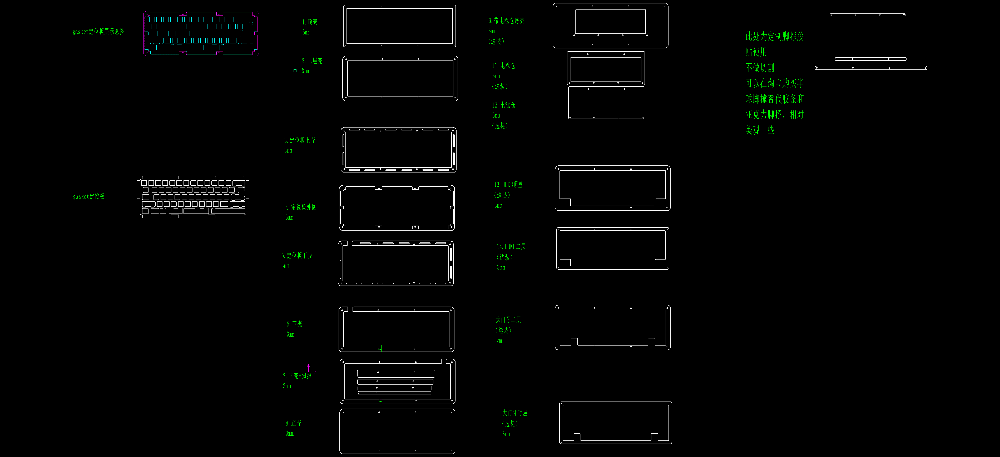
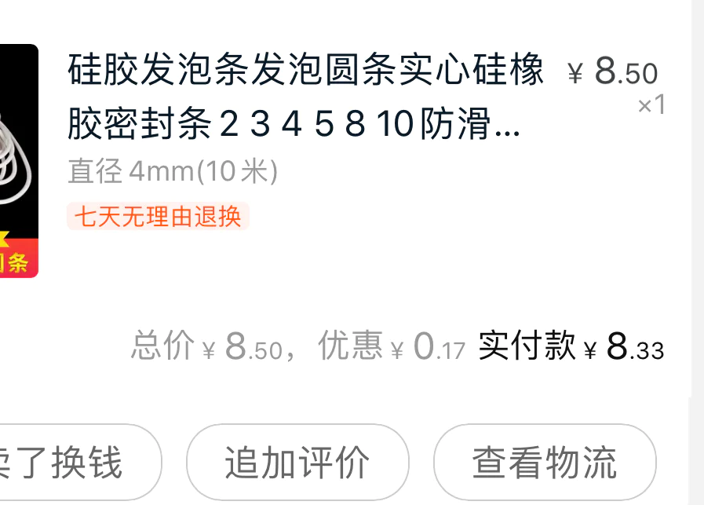

# Acrylic_gasket_keyboard

Stacked acrylic sheets to make a keyboard shell with a gasket structure including positioning plates.

本项目基于blacase 315 绘制，并使用MIT开源许可。

本项目特色：

- 将原三明治结构改成gakset结构
- 一层阶梯层，其余层完全相同尺寸，除第一层外无阶梯。本人喜欢这样的设计，去掉了其他层的阶梯，见仁见智。
- 层加定位板外圈亚克力，来承受螺丝向心力。
- 定位板与外圈有1mm的旷量，装配时适当调整可以避免定位板与壳子之间硬接触，达到真正的gasket目的。
- 定位板推荐做1.5mm铝定位。配合gmk原厂键帽声音好听直接能出雨滴音。
- 增加了大门牙上盖。
- 兼容GH60尺寸的60配列PCB。只做了非左移大兼容定位板，如果需要，请自己根据定位板外框尺寸进行更改。
- 淘宝购买4mm泡发胶条，别买错了，我第一次就买成了左边这种，比较硬，大家自行购买右边的这种白色软的泡发硅胶条。店铺不贴了，只告诉大家别花冤枉钱，这个东西不贵。

20200916 补充

- 调整胶条开槽位置

